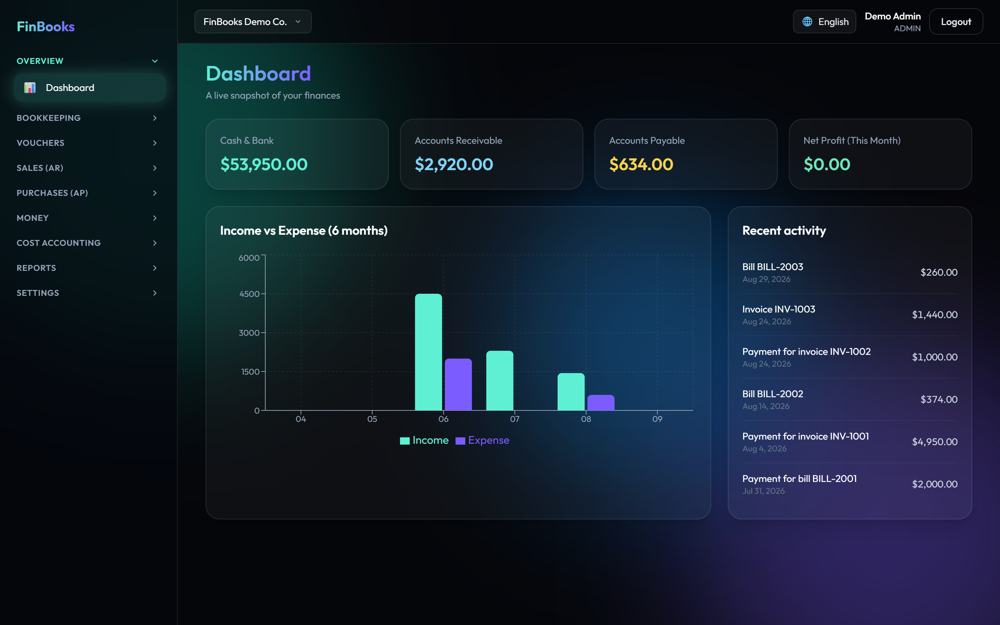
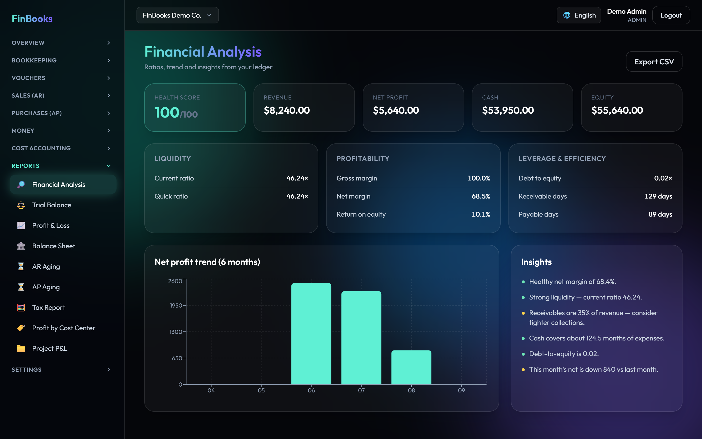
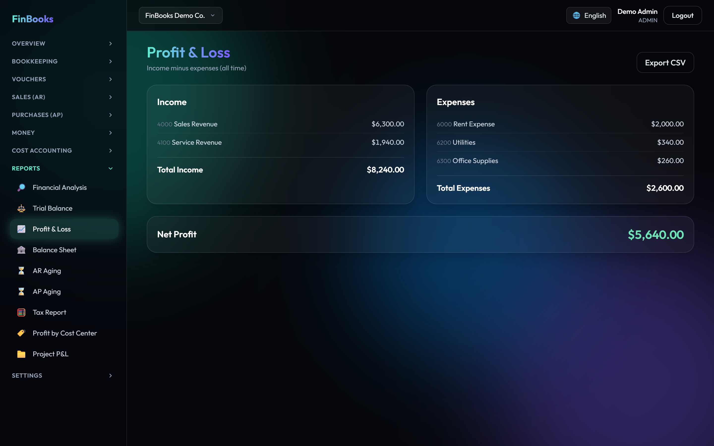
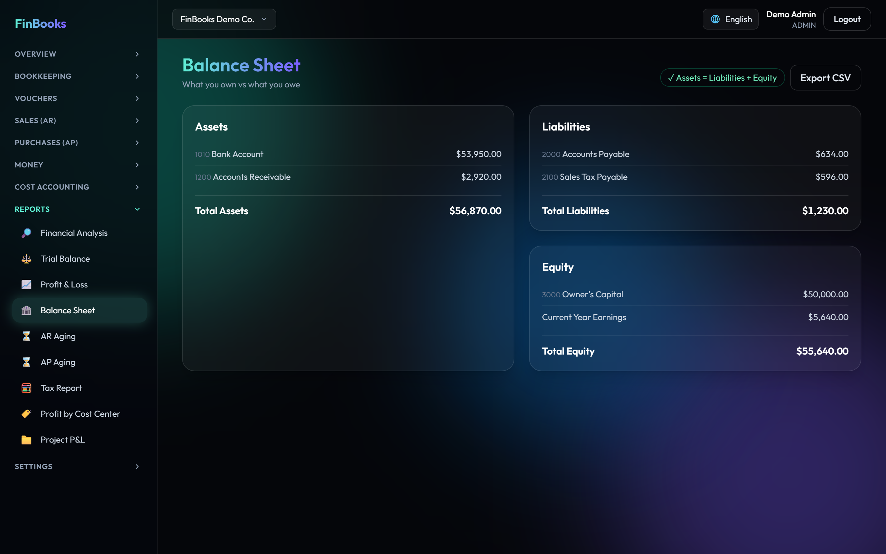
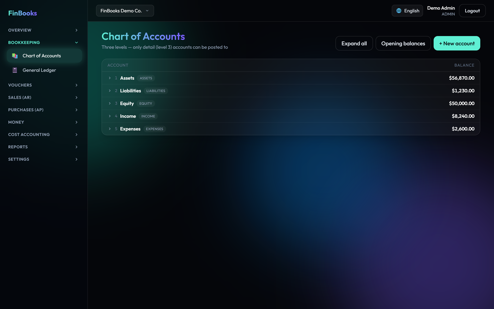
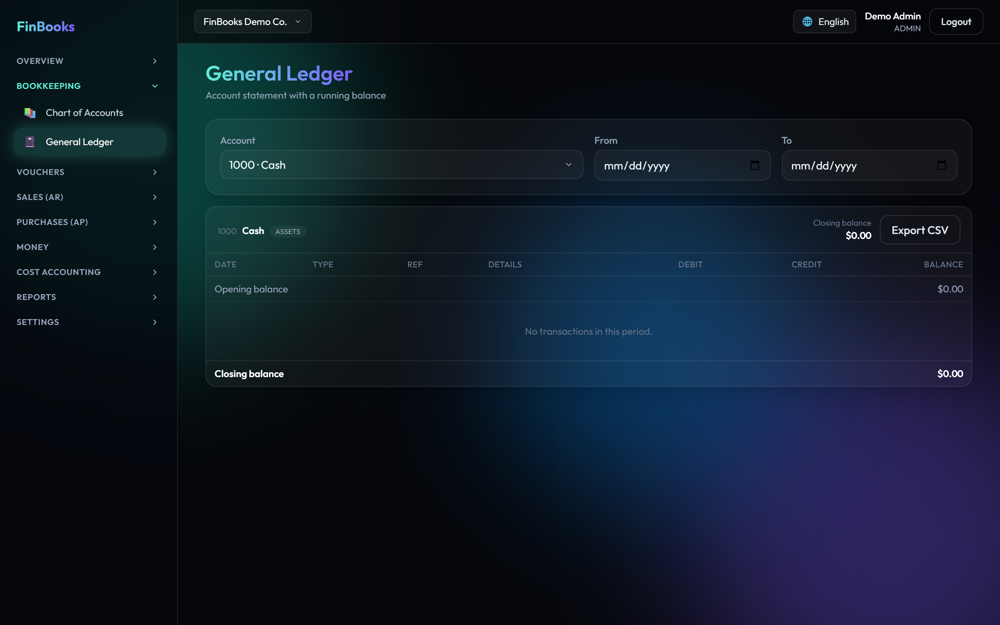
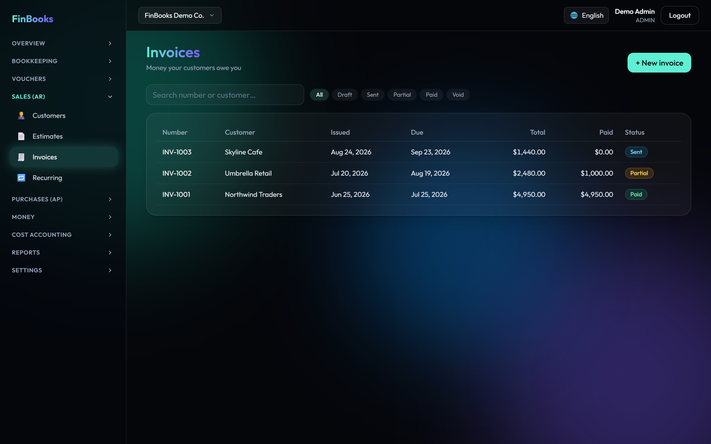
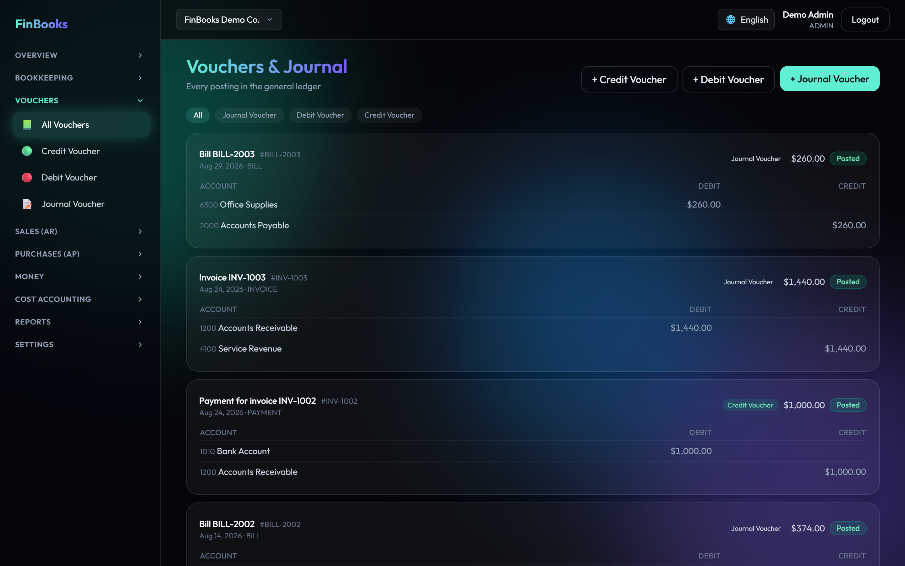

# FinBooks

A small-business accounting app I built to learn how real bookkeeping software works under the
hood — not just an income/expense tracker, but a proper **double-entry** system where every
transaction hits a general ledger and the books actually have to balance.

The idea was to stop hand-waving "accounting" and force myself to get the fundamentals right:
a chart of accounts, journal entries where debits equal credits, invoices and bills that post
into the ledger, and financial statements that are calculated from the ledger instead of being
faked.

> **🌐 Live demo:** https://finbooks-two.vercel.app — sign in with `demo@finbooks.app` / `demo1234`
> *(the demo frontend is hosted on Vercel and talks to the live backend running on AWS EC2)*

## What it does

- **Chart of accounts** — a 3-level tree (assets, liabilities, equity, income, expenses), each account with a normal balance; only the leaf accounts are postable.
- **Vouchers & journal entries** — Journal, Debit (payment) and Credit (receipt) vouchers. There are guardrails so you can't post bad data: entries have to balance, you can't overdraw cash/bank without confirming, duplicate reference numbers are flagged, and you can lock the books before a date.
- **Invoices (AR)** — create, post to the ledger, record customer payments, track what's owed.
- **Bills (AP)** — same idea on the money-out side with vendors, plus a **Payments Due** view that groups what you owe into overdue / this week / upcoming.
- **Payment details** — save a vendor's or customer's bank / JazzCash / Easypaisa details on their record; at pay-time they show up (account number masked) with a copy button.
- **Reports** — Trial Balance, Profit & Loss, Balance Sheet, AR/AP aging, a tax summary, and a **Financial Analysis** page with liquidity/profitability ratios, a health score and plain-English insights — all built from the ledger.
- **Cost accounting** — tag transactions to cost centers and projects to see profit per department and per project.
- **Multi-company** — one login can belong to several organizations and switch between them; each has its own books, roles and settings.
- **Dashboard** — cash, receivables, payables, this month's profit, and a 6-month income vs expense chart.
- **Users & roles** — Admin / Accountant / Viewer access per company.
- **Languages** — the whole UI is available in English, Urdu and Arabic (with right-to-left layout), chosen per user so nothing mixes.
- **Print / PDF** — clean printable invoices and bills.

## Screenshots

<table>
  <tr>
    <td width="50%" valign="top"><b>Dashboard</b><br/><sub>Cash, receivables, payables and a 6-month income vs expense chart.</sub><br/></td>
    <td width="50%" valign="top"><b>Financial Analysis</b><br/><sub>Liquidity &amp; profitability ratios, a health score and plain-English insights.</sub><br/></td>
  </tr>
  <tr>
    <td width="50%" valign="top"><b>Profit &amp; Loss</b><br/><sub>Income statement calculated straight from the ledger.</sub><br/></td>
    <td width="50%" valign="top"><b>Balance Sheet</b><br/><sub>Assets, liabilities and equity — always in balance.</sub><br/></td>
  </tr>
  <tr>
    <td width="50%" valign="top"><b>Chart of Accounts</b><br/><sub>A 3-level account tree with normal balances.</sub><br/></td>
    <td width="50%" valign="top"><b>General Ledger</b><br/><sub>Every posting, traceable back to its journal entry.</sub><br/></td>
  </tr>
  <tr>
    <td width="50%" valign="top"><b>Invoices (AR)</b><br/><sub>Create, post and track customer invoices.</sub><br/></td>
    <td width="50%" valign="top"><b>Journal</b><br/><sub>Double-entry vouchers where debits must equal credits.</sub><br/></td>
  </tr>
</table>

## Tech

- **Backend:** Node.js, Express, TypeScript, Prisma, MySQL, JWT.
- **Frontend:** React, Vite, TypeScript, Tailwind CSS, Recharts, i18next.

The one rule I kept coming back to: the general ledger is the source of truth. Invoices, bills
and payments don't store their own "truth" — they post balanced journal entries, and every report
reads from those. Money is stored as `DECIMAL`, never a float, so the cents always add up.

## Running it locally

You'll need Node 18+ and a MySQL server (I used XAMPP). Point `backend/.env` at your database, then:

```bash
# backend
cd backend
npm install
npx prisma migrate dev --name init
npm run db:seed
npm run dev

# frontend (second terminal)
cd frontend
npm install
npm run dev
```

Then open http://localhost:5173 and log in with the demo account:

```
demo@finbooks.app  /  demo1234
```

The seed loads a demo company with a few customers, vendors, invoices and bills already posted,
so the dashboard and reports have something to show right away.

## Notes

This is a learning/portfolio project, so a few things are deliberately out of scope for now:
multi-currency, payroll, inventory and bank reconciliation. The data model leaves room for them.
